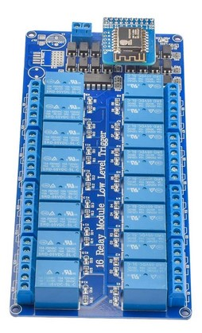
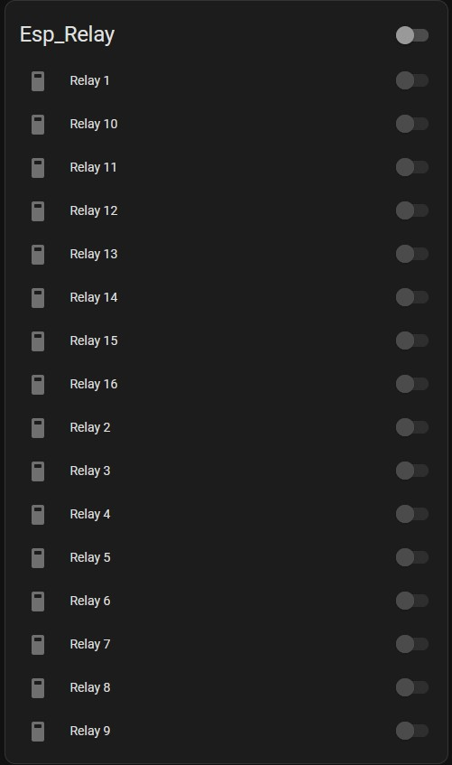
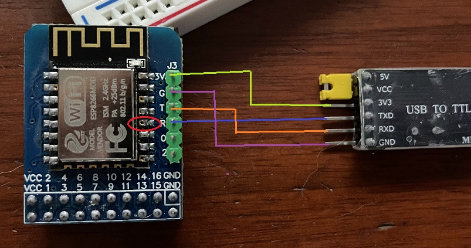

# 16_relay_board
esphome code for aliexpress 16 relay board with esp01 controller

This is code utilitzing esphome to control a 16 relay board from aliexpress.  The board uses an esp01 with a PCF8574 GPIO expander I2C 8-bit built in to control the 16 pins on the relay board.

This code can be used in Home Assistant.  The elements can be added to a dashboard for control and further use.

Flashing the ESP board is the tricky part because it doesn't have a usb interface.

I had to buy a usb to ttl device and solder some header pins to be able to flash it.  I bought a board that utilizes CH340G off of aliexpress for a few dollars.

Important info: make sure the usb device is on the 3.3v setting and not 5v.
The TX and RX wires swap. Meaning TX on the usb is RX on the esp device and vice versa

To enable programming mode I had to ground the 'en' pin on bootup.  I held a ground wire to the pin (pin 5 that is circled) and plugged in the usb stick.  after it booted (1 second) i removed it and it was in programming mode

From there i used esphome in the browser to do the initial flash with wifi info. After i was able to connect via wifi in esphome in Home Assistant and could program normally.
